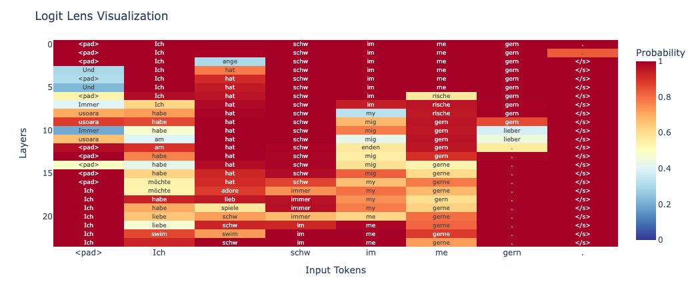

# T5-Lenses

This repository contains a small adaption of the Huggingface Code for T5 to support Logit Lens and Decoder Lens for T5-style Encoder-Decoder Models. 

## Logit Lens

The notebook `logit_lens.ipynb` includes examples for a logit lens run through the layers of decoder part of the models. The code was adapted from nostalgebraist ([Blog Post](https://www.lesswrong.com/posts/AcKRB8wDpdaN6v6ru/interpreting-gpt-the-logit-lens), [Code](https://colab.research.google.com/drive/1-nOE-Qyia3ElM17qrdoHAtGmLCPUZijg?usp=sharing#scrollTo=-l5oh4khUODz)).

### Example Results with T5-large

The notebook contains code to render the results as a nice plot: The plot shows the decoder logit lens results for the prompt "translate from English to German: I like to swim." 
The code for the plot comes from [NNsight](https://nnsight.net/notebooks/tutorials/logit_lens/).

## Decoder Lens

The notebook `decoder_lens.ipynb` contains an example for the decoder lens method which basically uses the run through the encoder up to a specific layer and then decodes the result based on the encoder output of that specific layer. The method was introduced in this [paper](https://arxiv.org/pdf/2310.03686).

### Example Results with T5-large:
```python
> run_example("translate English to German: Hello, how are you?", generation_config)

Layer 0: <pad> Hello?? Hello?</s>
Layer 1: <pad> Deutsch? Deutsch?</s>
Layer 2: <pad> Deutsch? Deutsch? Deutsch?</s>
Layer 3: <pad> Deutsch? Deutsch? Deutsch?</s>
Layer 4: <pad> Wie ist es?</s>
Layer 5: <pad> Wie sind Sie?</s>
Layer 6: <pad> Wie sind Sie?</s>
Layer 7: <pad> Wie sind Sie?</s>
Layer 8: <pad> Wie sind Sie?</s>
Layer 9: <pad> Wie sind Sie?</s>
Layer 10: <pad> Wie sind Sie?</s>
Layer 11: <pad> Wie sind Sie?</s>
Layer 12: <pad> Wie sind Sie?</s>
Layer 13: <pad> Wie sind Sie?</s>
Layer 14: <pad> Wie sind Sie?</s>
Layer 15: <pad> Wie sind Sie?</s>
Layer 16: <pad> Hallo, wie sind Sie?</s>
Layer 17: <pad> Hallo, wie sind Sie?</s>
Layer 18: <pad> Hallo, wie bist du?</s>
Layer 19: <pad> Hallo, wie bist du?</s>
Layer 20: <pad> Hallo, wie bist du?</s>
Layer 21: <pad> Hallo, wie sind Sie?</s>
Layer 22: <pad> Hallo, wie sind Sie?</s>
Layer 23: <pad> Hallo, wie sind Sie?</s>
```
